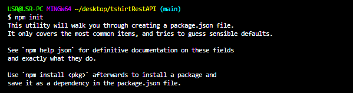

# RESTful API's 

## Courtesy and Followed this video tutorial on Youtube
https://youtu.be/-MTSQjw5DrM

## About Code
The code is about using RESTful API's from scratch by which we can render the data from the server and add the data into the server by using the HTTP request verbs.

## Prerequisites

* code text editors (Atom or visual studio code)
* Express.js
* Node.js
* Hyper Terminal
* API clients(postman or insomnia)

## How to run the app

1. Initialise the npm.

2. Install the npm.

3. Start the server 

4. You can access the app at http://localhost:3000

5. Use the API client [insomnia](https://insomnia.rest/) to generate the HTTP request verbs.

## API'S I have used in my App?

I have made use of the Post and Get request verbs of HTTP. Used Post to write(insert) the data to the server where the data can be reused in the server.

## Accessing the API's

I have accessed the API's such as Get and Post by using the express application and used route and callback function in Get and Post function call.

<!-- ## Inspiration

I got inspired to  create this application after having an access to one of the useful resource on the [youtube](https://youtu.be/-MTSQjw5DrM). 
 -->

