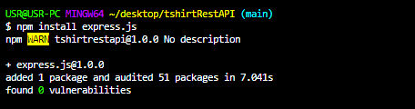
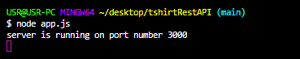
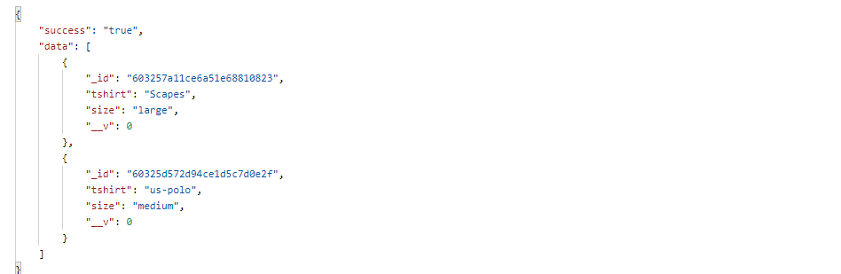
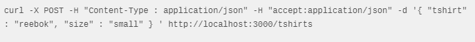
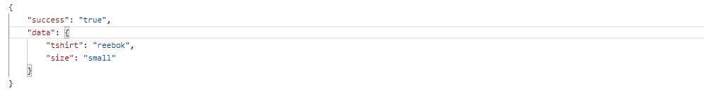
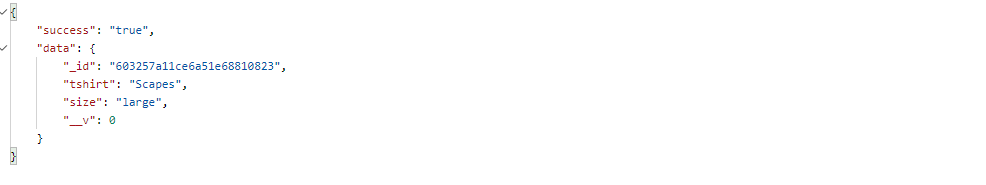
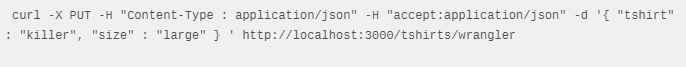
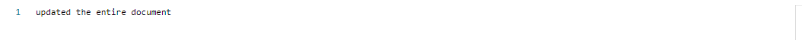
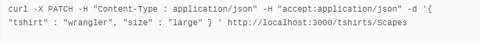

# RESTful-APIs 

## Courtesy and Followed this video tutorial on Youtube
https://youtu.be/-MTSQjw5DrM

## About Code
The code is about using RESTful API's from scratch by which we can render the data from the server and add the data into the server by using the HTTP request verbs.

## Prerequisites

* code text editors (Atom or visual studio code)
* Express.js
* Node.js
* Hyper Terminal(CLI) or Robo3T(GUI)
* MongoDB
* Mongoose
* API clients(postman or insomnia)

## How to run the app

1. Install the npm.

2. Start the server.

3. You can access the app at http://localhost:3000

4. Download,Install MongoDB and Start the Mongo server(It is hosted on port 27017).

5. Use the API client [postman](https://insomnia.rest/) to generate the HTTP request verbs.

## API'S I have used in my App?

I have made use of the all the request verbs of HTTP(API's) to perform the CRUD operations for the main route and specific route .The list of all API's I have used are shown below.

### Get All Tshirt

### Create Tshirt

### Get Specific Tshirt

### Update Entire Tshirt

### Update part of Tshirt Document

### Remove Tshirt

## Accessing the API's

I have accessed the API's such as Get,Post,Put,Patch,Delete by using the express application and used route and callback function in all API function calls.

<!-- ## Inspiration

I got inspired to  create this application after having an access to one of the useful resource on the [youtube](https://youtu.be/-MTSQjw5DrM). 
 -->

